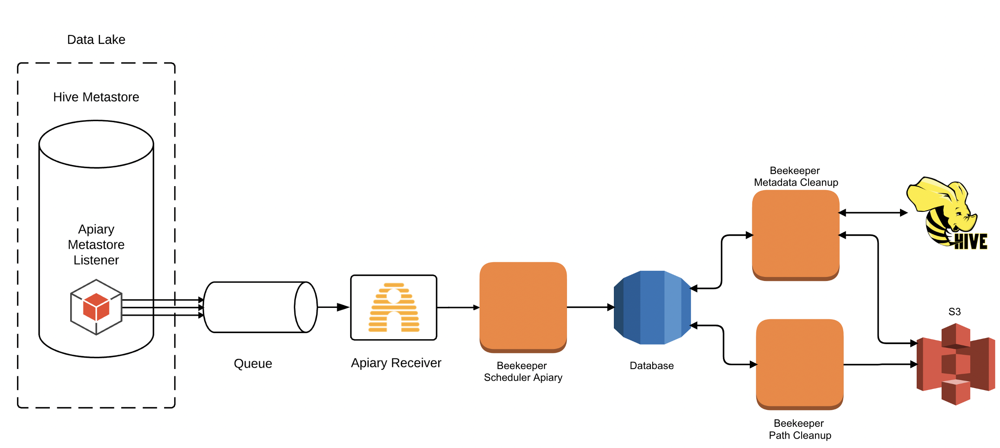

# Overview [](https://travis-ci.com/ExpediaGroup/beekeeper) 

Beekeeper is a service that schedules orphaned paths for deletion.

The original inspiration for a data deletion tool came from another of our open source projects called [Circus Train](https://github.com/HotelsDotCom/circus-train). At a high level, Circus Train replicates Hive datasets. The datasets are copied as immutable snapshots to ensure strong consistency and snapshot isolation, only pointing the replicated Hive Metastore to the new snapshot on successful completion. This process leaves behind snapshots of data which are now unreferenced by the Hive Metastore, so Circus Train includes a Housekeeping module to delete these files later.

Beekeeper is based on Circus Train's Housekeeping module, however it is decoupled from Circus Train so it can be used by other applications as well.

## Start using

To deploy Beekeeper in AWS, see the [terraform repo](https://github.com/ExpediaGroup/beekeeper-terraform). 

Docker images can be found in Expedia Group's [dockerhub](https://hub.docker.com/search/?q=expediagroup%2Fbeekeeper&type=image). 

# How does it work?

Beekeeper makes use of [Apiary](https://github.com/ExpediaGroup/apiary) - an open source federated cloud data lake - to detect changes in the Hive Metastore. One of Apiary’s components, the [Apiary Metastore Listener](https://github.com/ExpediaGroup/apiary-extensions/tree/master/apiary-metastore-events/apiary-metastore-listener), captures Hive events and publishes these as messages to an SNS topic. Beekeeper uses these messages to detect changes to the Hive Metastore, and perform appropriate deletions.

Beekeeper comprises two separate Spring-based Java applications. One application schedules paths for deletion in a shared database, and the other performs deletions.

## End-to-end lifecycle example



1. A Hive table is configured with the parameter `beekeeper.remove.unreferenced.data=true` (see [Hive table configuration](#hive-table-configuration) for more details.)
2. An operation is executed on the table that orphans some data (alter partition, drop partition, etc.)
3. Hive Metastore events are emitted by the [Hive Metastore Listener](https://github.com/ExpediaGroup/apiary-extensions/tree/master/apiary-metastore-listener) as a result of the operation.
4. Hive events are picked up from the queue by Beekeeper using [Apiary Receiver](https://github.com/ExpediaGroup/apiary-extensions/tree/master/apiary-receivers).
5. Beekeeper processes these messages and schedules orphaned paths or expired tables for deletion by adding them to a database.
6. The scheduled paths or tables are deleted by Beekeeper after a configurable delay, the default is 3 days for paths and 30 days for tables (see [Hive table configuration](#hive-table-configuration) for more details.)

## Supported events

Beekeeper will currently only be triggered by these events:
- `alter_partition`
- `alter_table`
- `drop_partition`
- `drop_table`

By default, `alter_partition` and `alter_table` events require no further configuration. However, in order to avoid unexpected data loss, other event types require whitelisting on a per table basis. See [Hive table configuration](#hive-table-configuration) for more details.

## Hive table configuration

Beekeeper only actions on events which are marked with a specific parameter. This parameter, as well as other parameters, need to be added to the Hive table that you wish to be monitored by Beekeeper. The configuration parameters for Hive tables are as follows:

| Parameter             | Required | Possible values | Description |
|:----|:----:|:----:|:----|
| `beekeeper.remove.unreferenced.data=true`   | Yes |  `true` or `false`       | Set this parameter to ensure Beekeeper monitors your table for orphaned data. |
| `beekeeper.unreferenced.data.retention.period=X` | No | e.g. `P7D` or `PT3H` (based on [ISO 8601 format](https://en.wikipedia.org/wiki/ISO_8601)) | Set this parameter to control the delay between schedule and deletion by Beekeeper. If this is either not set, or configured incorrectly, the default will be used. Default is 3 days. |
| `beekeeper.hive.event.whitelist=X` | No | Comma separated list of event types to whitelist for orphaned data. Valid event values are: `alter_partition`, `alter_table`, `drop_table`, `drop_partition`. | Beekeeper will only process whitelisted events. Default value: `alter_partition`, `alter_table`. |
| `beekeeper.remove.expired.data=true`   | Yes |  `true` or `false`       | Set this parameter to enable TTL on your table. |
| `beekeeper.expired.data.retention.period=X` | No | e.g. `P7D` or `PT3H` (based on [ISO 8601 format](https://en.wikipedia.org/wiki/ISO_8601)) | Set this parameter to set the TTL duration for your table. If this is either not set, or configured incorrectly, the default will be used. Default value is `P30D` (30 days). |

This command can be used to add a parameter to a Hive Table:

```SQL
ALTER TABLE <table-name> SET TBLPROPERTIES("beekeeper.remove.unreferenced.data"="true");
```

# Running Beekeeper

Beekeeper comprises two Spring Boot applications, `beekeeper-cleanup` and `beekeeper-path-scheduler-apiary`, which run independently of each other:

- `beekeeper-cleanup` periodically queries a database for paths to delete and performs deletions. 
- `beekeeper-path-scheduler-apiary` periodically polls an Apiary SQS queue for Hive metastore events and inserts S3 paths to be deleted into a database, scheduling them for deletion.

Both applications require configuration to be provided, see [Application configuration](#application-configuration) for details.

    java -jar <spring-boot-application>.jar --config=<config>.yml
    
`<config>.yml` takes this format:

```yaml
spring.datasource:
  url: jdbc:mysql://<database-url>:3306/beekeeper?useSSL=false
  username: <username>
  password: <password>   
  
# other config
```

This can be provided via a file or Spring can load properties from the environment (see below). 

## Using Docker

Two Docker images are created during `mvn install` one for cleanup and one for path scheduling. 

Configuration can be provided in one of two ways:

1. Using environment variables.

```
docker run --env-file <config-env>.env <image-id>
```

`<config-env>.env` takes this format:

```properties
spring_datasource_url=jdbc:mysql://<database-url>:3306/beekeeper?useSSL=false
spring_datasource_username=<user>
spring_datasource_password=<password>

# other config
```

Any additional configuration can be added in a similar way as the app will load properties from the docker environment.

2. Using a base64 encoded properties file as an environment variable:

```
export BEEKEEPER_CONFIG=$(base64 -w 0 -i <config>.yml)
docker run -e BEEKEEPER_CONFIG=$BEEKEEPER_CONFIG <image-id>
```

`<config>.yml` takes this format:

```yaml
spring.datasource:
  url: jdbc:mysql://<database-url>:3306/beekeeper?useSSL=false
  username: <username>
  password: <password>   
  
# other config
```

#### Database password

To avoid the problem of a plaintext password, AWS Secrets Manager is supported.

To use Secrets Manager, remove the password from the `<config>.yml`: 

```yaml
spring.datasource:
  url: jdbc:mysql://<database-url>:3306/beekeeper?useSSL=false
  username: <username>
  
# other config
```

and provide the password strategy and password key when running the container:

```
docker run -e BEEKEEPER_CONFIG=$BEEKEEPER_CONFIG -e DB_PASSWORD_STRATEGY=aws-secrets-manager -e DB_PASSWORD_KEY <password-key> <image-id>
```

#### Local dockerised database

If you would like to connect a dockerised application to a local MySQL database (e.g. initialised from `docker-compose up`), the two containers need to be on the same network:

    docker run --network beekeeper_default <image-id>

where `<database-url>` is the name of the running MySQL container.

## Endpoints

Being a Spring Boot Application, all [standard actuator endpoints](https://docs.spring.io/spring-boot/docs/current/reference/html/production-ready-endpoints.html) are supported.

For example, the healthcheck endpoint at: `http://<address>:<port>/actuator/health`. 

By default, `beekeeper-path-scheduler-apiary` listens on port 8080 and `beekeeper-cleanup` listens on port 8008. To access this endpoint when running in a Docker container, the port must be published:

    docker run -p <port>:<port> <image-id>

## Application configuration
### Beekeeper Path Scheduler Apiary
| Property                            | Required | Description |
|:----|:----|:----|
| `apiary.queue-url`                  | Yes      | URL for SQS queue. |
| `beekeeper.default-cleanup-delay`   | No       | Default Time To Live (TTL) for orphaned paths in [ISO 8601](https://en.wikipedia.org/wiki/ISO_8601#Durations) format: only days, hours, minutes and seconds can be specified in the expression. Default value is `P3D` (3 days). |
| `beekeeper.default-expiration-delay`| No       | Default Time To Live (TTL) for tables in [ISO 8601](https://en.wikipedia.org/wiki/ISO_8601#Durations) format: only days, hours, minutes and seconds can be specified in the expression. Default value is `P30D` (30 days). |

### Beekeeper Cleanup
| Property             | Required | Description |
|:----|:----:|:----|
| `cleanup-page-size`  | No       | Number of rows that should be processed in one page. Default value is `500`. |
| `dry-run-enabled`            | No       | Enable to simply display the deletions that would be performed, without actually doing so. Default value is `false`. |
| `scheduler-delay-ms` | No       | Amount of time (in milliseconds) between consecutive cleanups. Default value is `300000` (5 minutes after the previous cleanup completes). |

### Metrics

Beekeeper currently supports Graphite and Prometheus metrics.

Prometheus metrics are exposed at `/actuator/prometheus`.

Graphite metrics require configuration to enable. If Graphite is enabled, both host and prefix are required. If they are not provided, the application will throw an exception and not start.

The following table shows the configuration that can be provided:

| Property             | Required | Description |
|:----|:----:|:----|
| `graphite.enabled`   | No       | Enable to produce Graphite metrics. Default value is `false`. |
| `graphite.host`   | If enabled     | Graphite host. |
| `graphite.prefix` | If enabled     | Prefix for Graphite metrics. |
| `graphite.port`   | No       | Graphite port. Default is `2003`. |
| `prometheus.prefix` | No       | Prefix for Prometheus metrics. Default value is `beekeeper`. |

## External links

Please see the [Housekeeping](https://github.com/HotelsDotCom/housekeeping) library for more information.

# Legal
This project is available under the [Apache 2.0 License](http://www.apache.org/licenses/LICENSE-2.0.html).

Copyright 2019-2020 Expedia, Inc.
